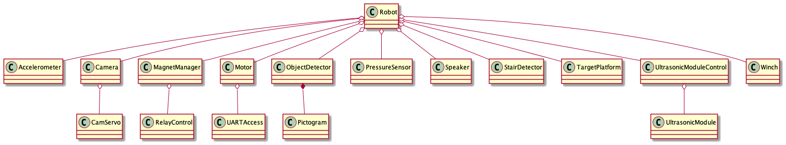
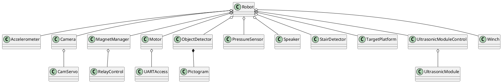

# Klassendiagramm PREN - Gefyra

```plantuml
@startuml
class Accelerometer{}
class Camera{}
class CamServo{}
class MagnetManager{}
class Motor{}
class ObjectDetector{}
class Pictogram{}
class PressureSensor{}
class RelayControl{}
class Robot{}
class Speaker{}
class StairDetector{}
class TargetPlatform{}
class UARTAccess{}
class UltrasonicModule{}
class UltrasonicModuleControl{}
class Winch{}


Robot o-- Accelerometer
Robot o-- Camera
Camera o-- CamServo
Robot o-- MagnetManager
MagnetManager o-- RelayControl
Robot o-- Motor
Motor o-- UARTAccess
Robot o-- ObjectDetector
ObjectDetector *-- Pictogram
Robot o-- PressureSensor
Robot o-- Speaker
Robot o-- StairDetector
Robot o-- TargetPlatform
Robot o-- UltrasonicModuleControl
UltrasonicModuleControl o-- UltrasonicModule
Robot o-- Winch
@enduml
```