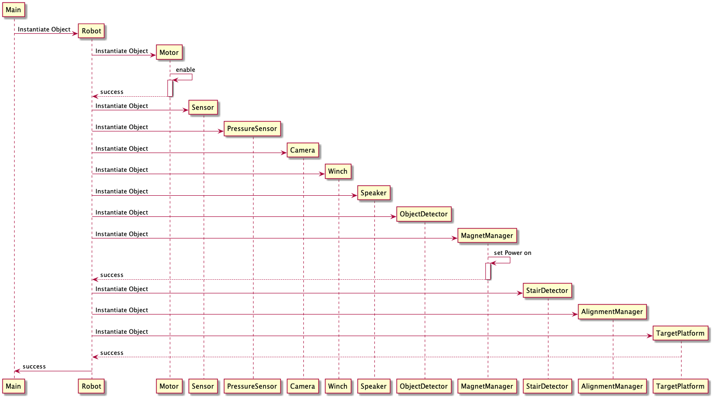

# Sequenzdiagramm Initialisierung

Initialisierung des Roboters durch die ``main``-Methode.




```plantuml
Main -> Robot **: Instantiate Object
Robot -> Motor **: Instantiate Object
Motor -> Motor ++: enable
Motor --> Robot --: success
Robot -> Sensor **: Instantiate Object
Robot -> PressureSensor **: Instantiate Object
Robot -> Camera **: Instantiate Object
Robot -> Winch **: Instantiate Object
Robot -> Speaker **: Instantiate Object
Robot -> ObjectDetector **: Instantiate Object
Robot -> MagnetManager **: Instantiate Object
MagnetManager -> MagnetManager ++: set Power on
MagnetManager --> Robot --: success
Robot -> StairDetector **: Instantiate Object
Robot -> AlignmentManager **: Instantiate Object
Robot -> TargetPlatform **: Instantiate Object
return success
Robot -> Main -- : success
```